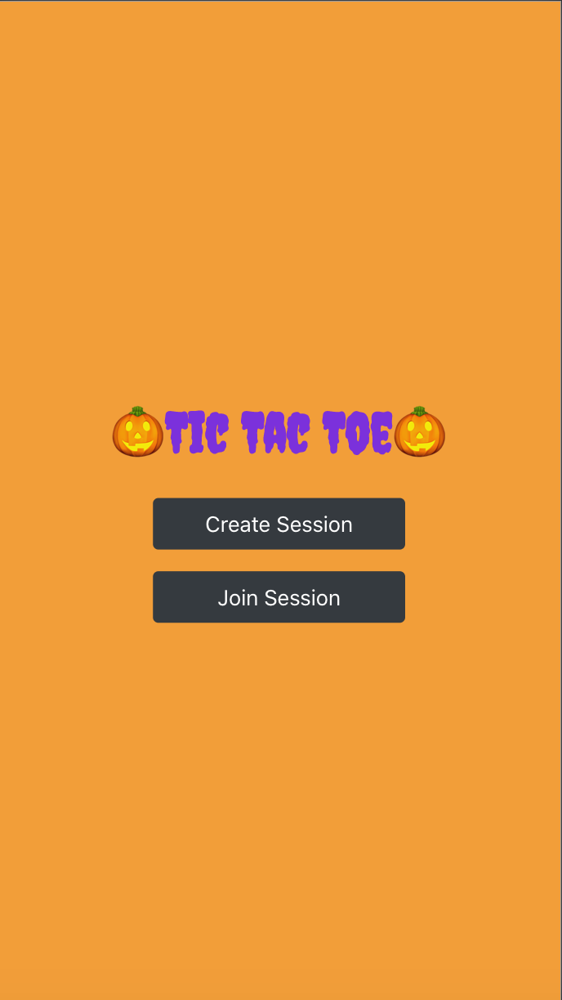
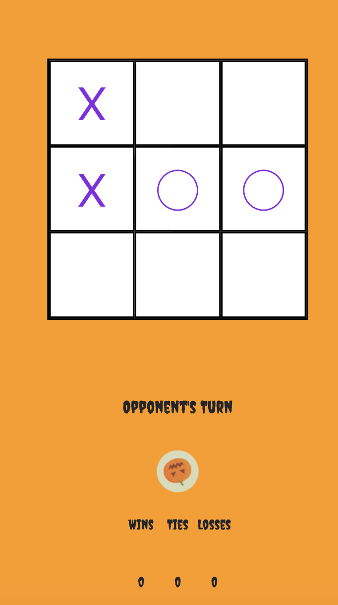
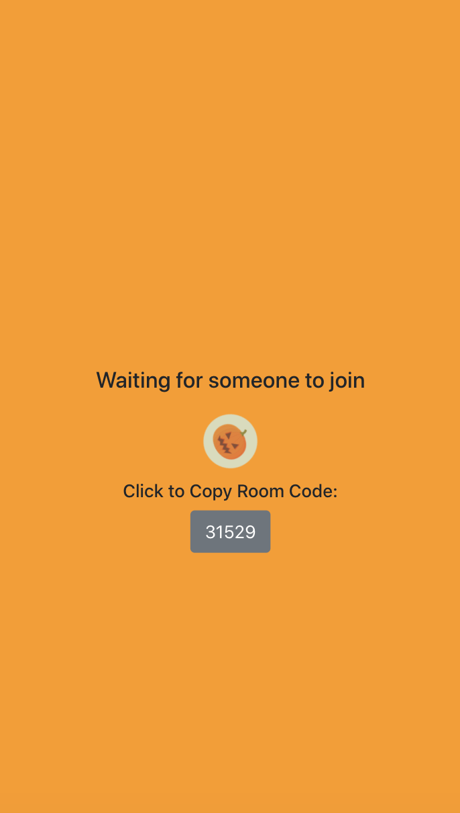

<br />
<p align="center">

  <h1 align="center">🎃 Tic Tac Toe Game - Halloween edition 🎃</h1>

  <p align="center">
    Welcome! 
  <br />
    Let's play Tic Tac Toe with your friend!! 
    <br />
    <br />
    <a href="https://react-tic-tac-toe-app-eri.herokuapp.com/">👉 Demo of App on Heroku</a>
  </p>
</p>


<!-- ABOUT THE PROJECT -->
## About The Project

This is a Tic Tac Toe app where two people on the web or mobile can compete each other to a classic game of tic-tac-toe. Since this is a Halloween seasion the app is a special Halloween edition! 

<br />
<p float="left">


</p>


Features:
* Web and mobile friendly
* You can add a friend to the game room
* You can see how many times you won or lost


### Built With
* [JavaScript](https://reactjs.org/)
* [Express](https://expressjs.com/)
* [Socket.IO](https://socket.io/)


## Getting Started

Let's get ready to play Tic Tac Toe! 

### Tested environment: 
- macOS 10.15.5 
- iOS 14
- Heroku(node)


### Installation

1. Clone the repo
2. Install Yarn packages
```sh
yarn install
```
2. Install dependencies.
```sh
yarn 
```
3. Start the server
```sh
yarn server
```
4. Start the react server
```sh
yarn client
```


## Usage

<table>
  <tr>
    <td><h3>1. Player1: click the "Create Session" button.</h3></td>
     <td><h3>2. Enter your username.</h3></td>
  </tr>
  <tr>
    <td></td>
    <td></td>
  </tr>
    <tr>
    <td><h3>3. Share the roomcode with oppnent and wait for joining the room.</h3></td>
     <td><h3>4. Player2: After click "Join Session" add your username and roomcode</h3></td>
  </tr>
    <tr>
    <td></td>
    <td></td>
  </tr>
 </table>

<br />
<br />

<h2>Enjoy!👻</h2>


